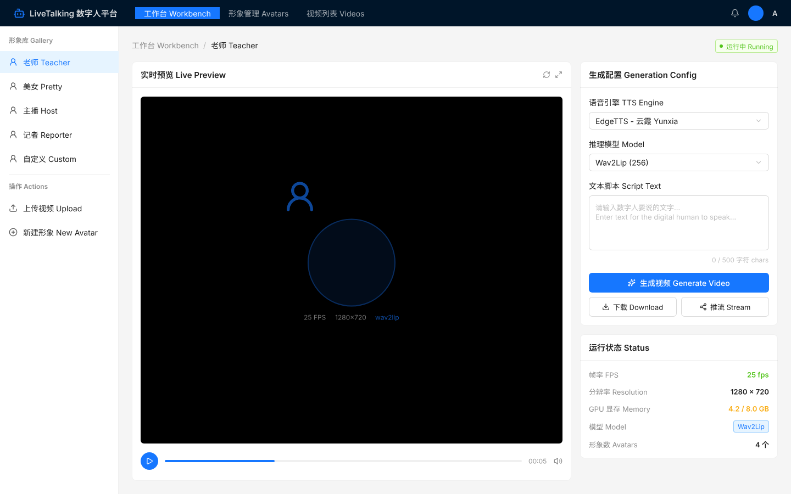
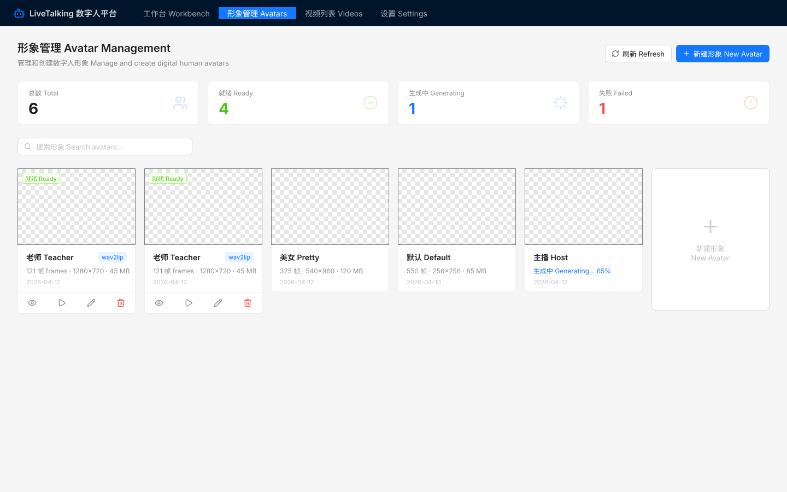
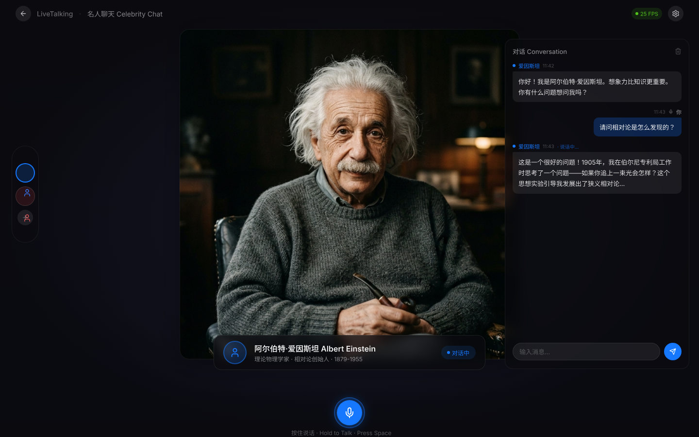
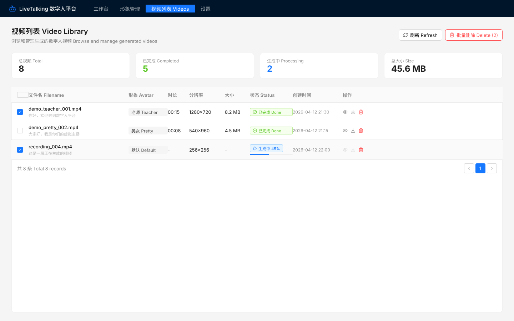
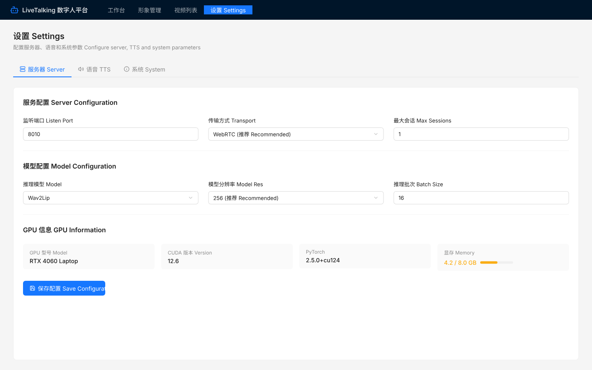

<p align="center">
  <h1 align="center">LiveTalking 数字人平台</h1>
  <h3 align="center">Real-time Digital Human Platform</h3>
  <p align="center">
    基于 LiveTalking 的实时交互数字人平台，提供完整 Web UI、名人聊天、多引擎支持
    <br/>
    A full-featured digital human platform with Web UI, celebrity chat, and multi-engine support
  </p>
  <p align="center">
    
    
    
    
    
  </p>
</p>

---

## 功能亮点 / Features

<table>
<tr>
<td width="50%">

**中文**

- 实时数字人 — Wav2Lip 驱动，25fps 实时渲染
- 名人聊天 — 沉浸式全屏 AI 角色对话
- 语音输入 — 浏览器 ASR，按 Space 说话
- 8 种 TTS — Kokoro 本地 175ms / EdgeTTS / GPT-SoVITS 等
- 5 种 LLM — 通义千问 / OpenAI / DeepSeek / Ollama / 自定义
- 形象管理 — 上传视频自动生成数字人
- 视频录制 — 录制、预览、下载
- 动作编排 — 4 种动作状态切换

</td>
<td width="50%">

**English**

- Real-time Avatar — Wav2Lip driven, 25fps rendering
- Celebrity Chat — Immersive full-screen AI persona dialogue
- Voice Input — Browser ASR, press Space to talk
- 8 TTS Engines — Kokoro local 175ms / EdgeTTS / GPT-SoVITS etc.
- 5 LLM Providers — Qwen / OpenAI / DeepSeek / Ollama / Custom
- Avatar Management — Upload video to auto-generate avatar
- Video Recording — Record, preview, download
- Action Choreography — 4 action states switching

</td>
</tr>
</table>

---

## 页面展示 / Screenshots

### 工作台 / Workbench

> 实时预览数字人、文本/音频驱动、录制、TTS/模型选择
>
> Live preview, text/audio driven, recording, TTS/model selection



### 形象管理 / Avatar Management

> 上传视频生成形象、实时进度、人脸裁剪预览、搜索过滤
>
> Upload video to generate avatar, real-time progress, face-crop preview, search



### 名人聊天 / Celebrity Chat

> 沉浸式全屏，AI 角色对话，语音输入，悬停显示 UI
>
> Immersive full-screen, AI persona chat, voice input, hover to reveal UI



### 视频列表 / Video Library

> 录制视频管理、筛选排序、批量操作、预览下载
>
> Recorded video management, filter/sort, batch operations, preview/download



### 设置 / Settings

> 服务器/TTS/LLM/系统配置、GPU 信息、测试连接
>
> Server/TTS/LLM/System config, GPU info, test connection



---

## 快速开始 / Quick Start

### 环境要求 / Requirements

| 项目 Item | 要求 Requirement |
|-----------|------------------|
| Python | 3.10+ |
| CUDA | 12.0+ |
| GPU 显存 | 4GB+ |
| Node.js | 18+ |
| PyTorch | 2.5.0 |

### 1. 安装后端 / Install Backend

```bash
cd LiveTalking
python -m venv venv
source venv/Scripts/activate  # Windows
# source venv/bin/activate    # Linux/Mac

pip install torch==2.5.0 torchaudio==2.5.0 torchvision==0.20.0 \
    --index-url https://download.pytorch.org/whl/cu124
pip install -r requirements.txt
pip install kokoro soundfile ordered-set "misaki[zh]"
```

### 2. 下载模型 / Download Models

从 From [夸克网盘 Quark](https://pan.quark.cn/s/83a750323ef0) 或 or [Google Drive](https://drive.google.com/drive/folders/1FOC_MD6wdogyyX_7V1d4NDIO7P9NlSAJ):

- `wav2lip256.pth` → 重命名 rename to `wav2lip.pth` → `models/`
- `wav2lip256_avatar1.tar.gz` → 解压 extract to `data/avatars/`

### 3. 生成自定义形象 / Generate Custom Avatar

```bash
PYTHONPATH=. python avatars/wav2lip/genavatar.py \
    --video_path your_video.mp4 \
    --avatar_id your_avatar \
    --img_size 256 \
    --face_det_batch_size 4
```

### 4. 启动后端 / Start Backend

```bash
# 使用 Kokoro 本地 TTS（推荐，延迟 175ms）
# Use Kokoro local TTS (recommended, 175ms latency)
python app.py --transport webrtc --model wav2lip \
    --avatar_id your_avatar --modelres 256 --tts kokoro

# 或使用 EdgeTTS（在线，延迟 2400ms）
# Or use EdgeTTS (online, 2400ms latency)
python app.py --transport webrtc --model wav2lip \
    --avatar_id your_avatar --modelres 256 --tts edgetts
```

### 5. 安装并启动前端 / Install & Start Frontend

```bash
cd livetalking-ui
npm install
npx vite --port 3000
```

### 6. 打开浏览器 / Open Browser

访问 Visit http://localhost:3000

---

## 系统架构 / Architecture

```
┌─────────────────────────────────────────────────────────┐
│                    浏览器 Browser                        │
│  ┌──────────┐  ┌──────────┐  ┌──────────┐  ┌─────────┐ │
│  │ 工作台    │  │ 形象管理  │  │ 名人聊天  │  │ 设置    │ │
│  │Workbench │  │ Avatars  │  │Celebrity │  │Settings │ │
│  └────┬─────┘  └────┬─────┘  └────┬─────┘  └────┬────┘ │
│       │              │             │              │      │
│  ┌────┴──────────────┴─────────────┴──────────────┴───┐  │
│  │  React Hooks: useWebRTC / useSpeaking / useASR     │  │
│  │  API Layer: api.ts (统一请求 Unified requests)      │  │
│  └──────────────────────┬─────────────────────────────┘  │
└─────────────────────────┼────────────────────────────────┘
                          │ WebRTC + REST API
┌─────────────────────────┼────────────────────────────────┐
│                    后端 Backend                           │
│  ┌──────────────────────┴─────────────────────────────┐  │
│  │              aiohttp Server (:8010)                 │  │
│  │  /offer  /human  /avatar/*  /celebrity/*  /llm/*   │  │
│  └───┬──────────┬────────────┬───────────────┬────────┘  │
│      │          │            │               │           │
│  ┌───┴───┐  ┌──┴──┐   ┌────┴────┐    ┌─────┴─────┐    │
│  │Wav2Lip│  │ TTS │   │   LLM   │    │  Avatar   │    │
│  │推理   │  │合成  │   │ 大模型   │    │  管理     │    │
│  │Infer  │  │     │   │         │    │  Manage   │    │
│  └───────┘  └─────┘   └─────────┘    └───────────┘    │
│   65fps     Kokoro     Qwen/GPT      Upload/Gen       │
│             175ms      /DeepSeek     /Preview          │
└──────────────────────────────────────────────────────────┘
```

---

## 项目结构 / Project Structure

```
├── LiveTalking/                  # 后端 Backend
│   ├── app.py                    # 主入口 Main entry
│   ├── llm.py                    # 多厂商 LLM Multi-provider LLM
│   ├── config.py                 # CLI 参数 CLI arguments
│   ├── server/
│   │   ├── routes.py             # 核心 API Core API
│   │   ├── avatar_api.py         # 形象管理 Avatar management
│   │   ├── celebrity_api.py      # 名人聊天 Celebrity chat
│   │   ├── system_api.py         # 系统信息 System info
│   │   └── llm_api.py            # LLM 配置 LLM config
│   ├── tts/
│   │   ├── kokoro_tts.py         # 本地 TTS Local TTS (175ms)
│   │   ├── edge.py               # EdgeTTS (2400ms)
│   │   └── ...                   # 8 种引擎 8 engines
│   └── avatars/
│       ├── wav2lip_avatar.py     # 增强渲染 Enhanced rendering
│       └── base_avatar.py        # 基类 Base class
│
├── livetalking-ui/               # 前端 Frontend
│   └── src/
│       ├── App.tsx               # 路由+工作台 Router+Workbench
│       ├── constants.ts          # 常量 Constants
│       ├── hooks/                # 自定义 Hooks
│       │   ├── useWebRTC.ts      # WebRTC 连接 Connection
│       │   ├── useSpeaking.ts    # 说话状态 Speaking state
│       │   └── useASR.ts         # 语音识别 Speech recognition
│       ├── services/
│       │   └── api.ts            # API 统一层 Unified API layer
│       └── pages/
│           ├── AvatarsPage.tsx   # 形象管理 Avatar management
│           ├── VideosPage.tsx    # 视频列表 Video library
│           ├── SettingsPage.tsx  # 设置 Settings
│           ├── CelebrityPage.tsx # 名人聊天 Celebrity chat
│           └── CelebrityPage.css # 沉浸式样式 Immersive style
│
├── assets/                       # 截图 Screenshots
├── README.md
└── TEST_REPORT.md                # 测试报告 Test report (115/115)
```

---

## API 文档 / API Reference

<details>
<summary><b>会话控制 / Session Control</b></summary>

| 方法 Method | 端点 Endpoint | 说明 Description |
|-------------|---------------|-------------------|
| POST | /offer | WebRTC 信令，avatar 参数选择形象 / WebRTC signaling, avatar param |
| POST | /human | 文本输入 Text input (type: echo/chat) |
| POST | /humanaudio | 音频上传驱动 Upload audio to drive avatar |
| POST | /interrupt_talk | 打断说话 Interrupt speaking |
| POST | /is_speaking | 查询状态 Query speaking status |
| POST | /record | 录制控制 Recording (start_record/end_record) |
| POST | /set_audiotype | 动作编排 Action choreography |

</details>

<details>
<summary><b>形象管理 / Avatar Management</b></summary>

| 方法 Method | 端点 Endpoint | 说明 Description |
|-------------|---------------|-------------------|
| GET | /avatar/list | 形象列表 List avatars |
| POST | /avatar/create | 上传视频生成 Upload & generate |
| POST | /avatar/progress | 生成进度 Generation progress |
| POST | /avatar/delete | 删除形象 Delete avatar |
| GET | /avatar/preview/{id} | 人脸预览图 Face-crop preview |

</details>

<details>
<summary><b>名人聊天 / Celebrity Chat</b></summary>

| 方法 Method | 端点 Endpoint | 说明 Description |
|-------------|---------------|-------------------|
| GET | /celebrity/list | 名人列表 List celebrities |
| POST | /celebrity/chat | AI 角色对话 AI persona dialogue |
| POST | /celebrity/add | 添加名人 Add celebrity |

</details>

<details>
<summary><b>系统配置 / System Config</b></summary>

| 方法 Method | 端点 Endpoint | 说明 Description |
|-------------|---------------|-------------------|
| GET | /system/info | GPU/CUDA/PyTorch 信息 System info |
| GET | /video/list | 视频列表 Video list |
| GET/POST | /llm/config | LLM 配置 LLM config |
| POST | /llm/test | 测试连接 Test connection |

</details>

---

## LLM 配置 / LLM Configuration

<table>
<tr><th>厂商 Provider</th><th>模型 Models</th><th>配置 Config</th></tr>
<tr><td>通义千问 Qwen</td><td>qwen-plus / qwen-turbo / qwen-max</td><td><code>export DASHSCOPE_API_KEY=sk-xxx</code></td></tr>
<tr><td>OpenAI</td><td>gpt-4o / gpt-4o-mini</td><td><code>export OPENAI_API_KEY=sk-xxx</code></td></tr>
<tr><td>DeepSeek</td><td>deepseek-chat / deepseek-reasoner</td><td><code>export DEEPSEEK_API_KEY=sk-xxx</code></td></tr>
<tr><td>Ollama (本地 Local)</td><td>qwen2.5:7b / llama3:8b</td><td>无需 Key No key needed</td></tr>
<tr><td>自定义 Custom</td><td>任意 OpenAI 兼容 Any compatible</td><td>设置页面填写 Fill in Settings</td></tr>
</table>

---

## 性能 / Performance

| 指标 Metric | 数值 Value | 说明 Note |
|-------------|------------|-----------|
| Wav2Lip 推理 Inference | **65 fps** | 远超实时 Well above real-time |
| 视频输出 Output | **25 fps** | 稳定 Stable |
| Kokoro TTS 延迟 Latency | **175 ms** | 本地推理 Local inference |
| EdgeTTS 延迟 Latency | ~2,400 ms | 在线服务 Online service |
| TTS 加速比 Speedup | **14x** | Kokoro vs EdgeTTS |
| GPU 显存 VRAM | ~2.3 GB | RTX 4060 Laptop |
| 测试通过 Tests | **115/115** | 100% 通过率 Pass rate |

---

## 致谢 / Acknowledgments

- [LiveTalking](https://github.com/lipku/LiveTalking) — 实时数字人引擎 Real-time digital human engine
- [Kokoro-82M](https://github.com/hexgrad/kokoro) — 本地 TTS Local TTS engine
- [Ant Design](https://ant.design/) — UI 组件库 Component library
- [Vite](https://vitejs.dev/) — 前端构建 Frontend build tool

---

## License

Apache 2.0
